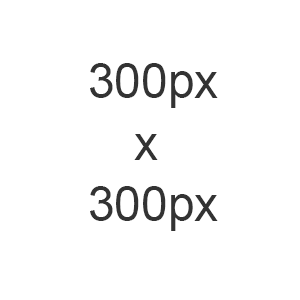

## Intro
This is a relatively simple image "lightbox" popup implementation, using html, jQuery and css. It's compact and straightforward. Only images (one image per popup open) are supported out-of-the-box. There's no text support and no slideshow, you're welcome to extend it.


## Why Another Lightbox Implementation?
There are a lot of lightboxes already available, but I didn't find one that worked for my purpose, even though many have a lot more features.
I just wanted to be able to click on an image and show a popup containing the image, plus 2 other requirements:
1. The popup should be contained within the browser window. An image that doesn't fit the browser window should shrink to fit itself inside the browser window, while maintaining its aspect-ratio.
2. The popup should be centered, not only horizontally but also vertically.

Requirement 2 is the one that I have most issues with, because the lightboxes that I found weren't centering vertically. The ones that did, are calculating the position and size in somewhat complicated manners on the Javascript side. My implementation doesn't calculate position. Instead, it lets css handles the sizing and centering.

## How to Use
1. Include <b>image-modal.js</b> and <b>image-modal.css</b>. Note: jQuery use is assumed, otherwise you need to include it.
```
<script src="js/image-modal.js"></script>
<link rel="stylesheet" href="css/style.css">
```
3. Add <b>image-popup</b> class to the &lt;img&gt; tags that you want the popup lightbox enabled.
```
</img>
```
3. Add the following html code somewhere on your page (I recommend at the end of the page). This is the placeholder that will render the popup. It is initially invisible.
```
<!-- Popup -->
<div id="image-modal-popup">
	<div id="image-modal-container">
		<div id="image-modal-dialog">
			</img>
			<div id="image-modal-loader"></div>
			<div id="image-modal-close-button"></div>
		</div>
	</div>
</div>
```
## Optional
1. Replace <b>loader.gif</b> and <b>close-button.gif</b> in the <b>images</b> folder if you want to modify them.
2. Edit <b>css/style.css</b> styling to your liking. 

## Demo Page
https://permadi.com/html-jquery-image-popup-lightbox/
* Click any of the images to open the image in a popup.
* Resize the browser to see how the popup behaves. Even when the popup is already open, the popup should always be centered horizontally and vertically, and the popup should always fit within the brower's vievable area.


